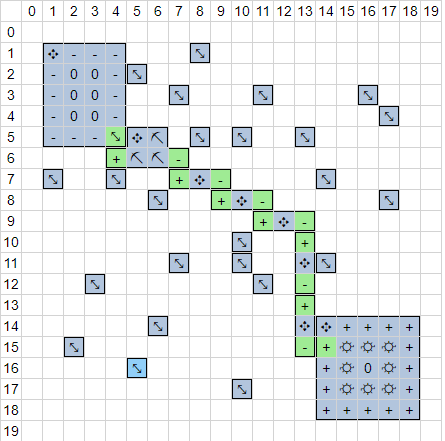

# Task Generator

Creating handcrafted tasks is effective for teaching specific concepts like finding a hole in an obstacle wall or optimizing for #turns by using multiple mines.  
However, creating hundreds of tasks manually is tedious work, so a simple program that generates tasks automatically may be used to augment the manual tasks.

## Concept
Step 1: Place (at least one) deposit and factory into an empty grid  
Step 2: Connect them with mines, conveyors, combiners using a simple distance heuristic   
Step 3: Turn each empty tile with a predetermined probability into a single celled obstacle (see img below)  
Step 4: Remove all mines, conveyors, combiners

## Goal
The agents has to learn to navigate these tiny obstacles which hopefully generalizes well on real tasks.  
Use the naive (possibly non-optimal) solution of Step 2 as the target score + #turns. 

## Extensions
Start with a non-empty grid, e.g. a "hole in the wall" scenario.  
Increase difficulty, by varying the free tile-to-obstacle probability or by using mutiple deposits and factories.

