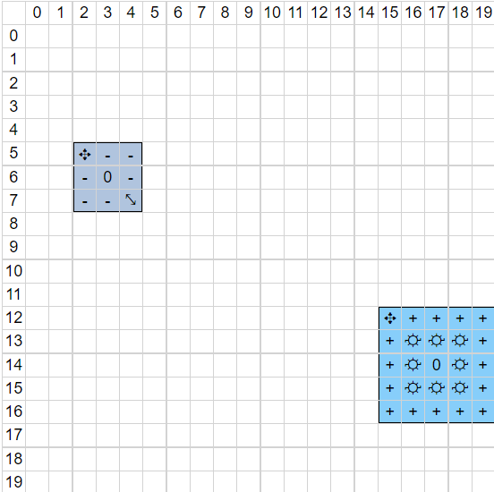
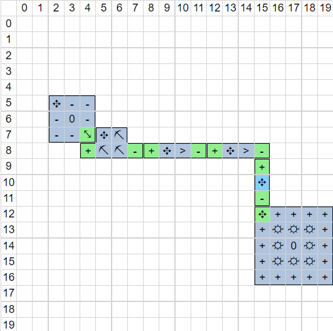
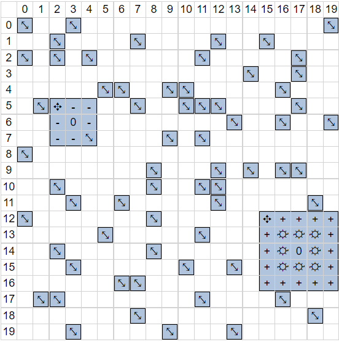
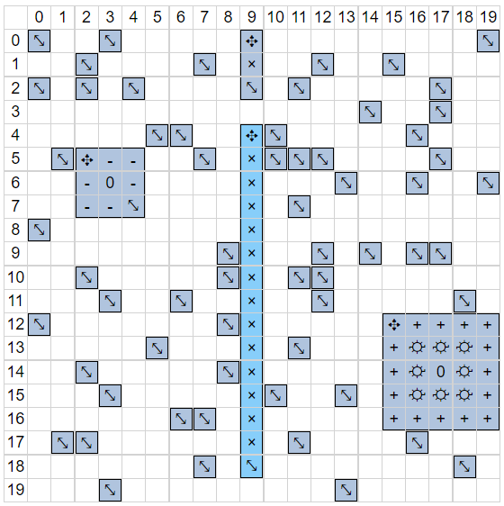

# Task Generator

Creating handcrafted tasks is effective for teaching specific concepts like finding a hole in an obstacle wall or optimizing for #turns by using multiple mines.  
However, creating hundreds of tasks manually is tedious work, so a simple program that generates tasks automatically may be used to augment the manual tasks.

## Concept
Step 1: Place (at least one) deposit and factory into an empty grid at random positions 

Step 2: Connect them with mines, conveyors, combiners using a simple distance heuristic   

Step 3: Turn each empty tile with a predetermined probability into a single celled obstacle (see img below)  

Step 4: Remove all mines, conveyors, combiners

## Goals
The agents has to learn to navigate these tiny obstacles which hopefully generalizes well on real tasks.  
We can use the naive (possibly non-optimal) solution of Step 2 as the target score + target #turns and even supervise our algorithm in the beginning phase.  
By including the factory in the generated training tasks, a RL algorithm may try to place a factory first when encoutered with a real task without any factories (similar to a human player).  

## Extensions
- Increase difficulty by using mutiple deposits and factories
- Vary the free-tile-to-obstacle probability
- Vary grid size
- Remove factories 
- Start with a non-empty grid, e.g. a "hole in the wall" scenario 

